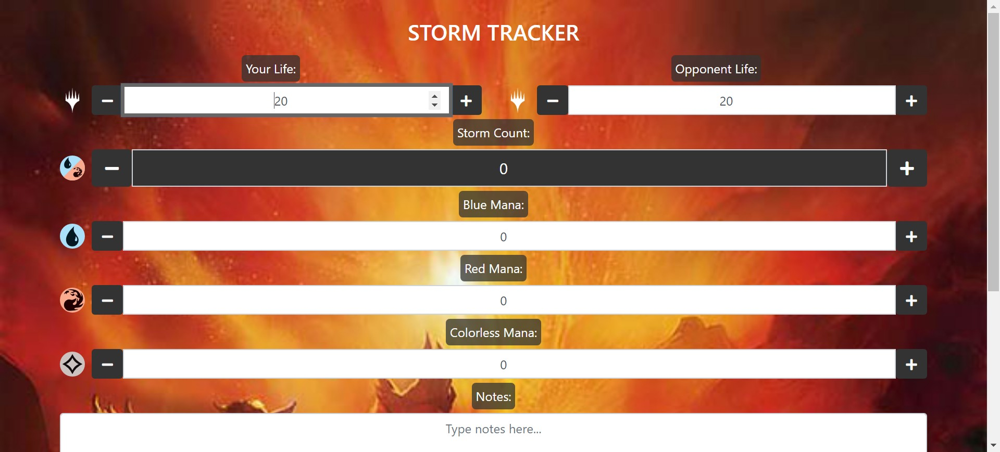
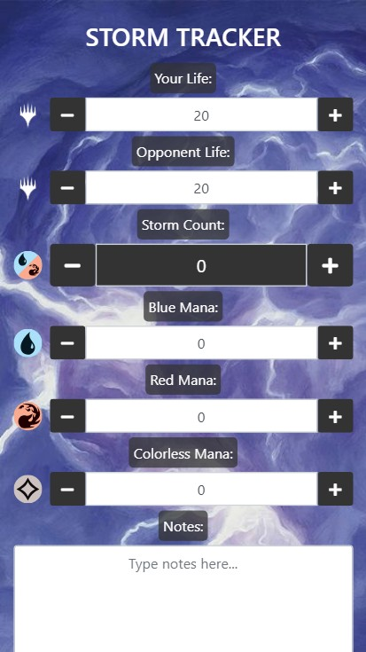

# Storm Tracker

https://justingolden21.github.io/storm-tracker/

Track mana, storm count, and more for MTG storm decks

### Features

** Track life totals, mana, and storm count**

** A beautiful random backdrop with beautiful mtg art**

** A Drain button to empty mana and storm count, and a Refresh button to reload the page**

** Dynamic displays of your mana pool and storm count**

** Use <kbd>Tab</kbd> and <kbd>Shift</kbd> + <kbd>Tab</kbd> to navigate inputs**

** UI designed to work well on mobile too**

### To Do

Background Images:

 Crop/edit images better for wallpapers

 Find more images?

 Use non-storm images?

Options:

 Option to turn off draw mana? (caps at 100 anyway)

### About

Feel free to recomend any images from MTG art you'd like to see as backdrops by either adding an "issue" or emailing me 😃

 By Justin Golden

 Email me:  mailto:justingolden@rgbstudios.org

 My website: https://justingolden21.github.io

 My repos: https://github.com/justingolden21

 This repo: https://github.com/justingolden21/storm-tracker
