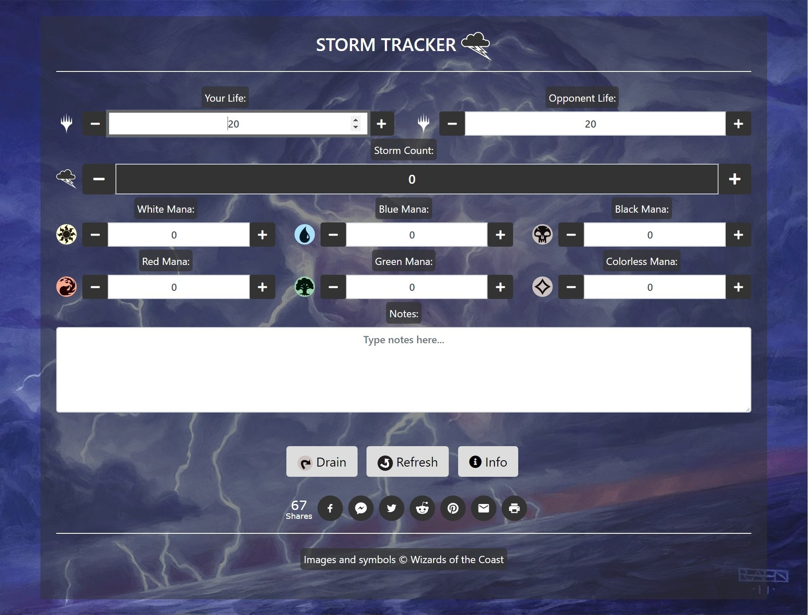

# Storm Tracker 

https://justingolden21.github.io/storm-tracker/

A tracker for MTG Storm decks. Track mana, storm count, and more on the go, without dice or counters.

### Features

** Track life totals, mana, and storm count**

** A beautiful random backdrop with beautiful mtg art**

** A Drain button to empty mana and storm count, and a Refresh button to reload the page**

** Dynamic displays of your mana pool and storm count**

** Use <kbd>Tab</kbd> and <kbd>Shift</kbd> + <kbd>Tab</kbd> to navigate inputs**

** UI designed to work well on mobile too**

### About

Feel free to recomend any images from MTG art you'd like to see as backdrops by either adding an "issue" or emailing me 😃

 By Justin Golden

 Email me: justingolden@rgbstudios.org

 My website: https://justingolden21.github.io

 My repos: https://github.com/justingolden21

 This repo: https://github.com/justingolden21/storm-tracker
